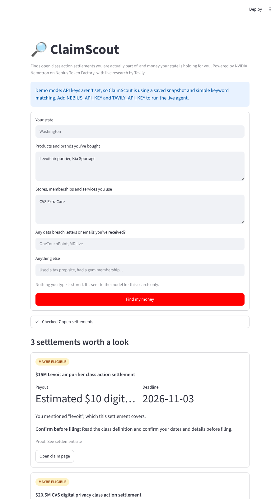
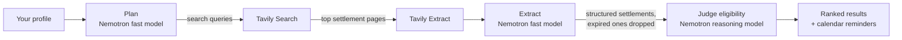

# 🔎 ClaimScout

**An AI agent that finds money you're actually owed.**

Most people who qualify for a class action settlement never file. The FTC found a median claims rate of about 9% in consumer settlements, because nobody reads the fine print on settlement sites and the deadlines are scattered across hundreds of pages. ClaimScout reads them for you. Tell it what you've bought, which stores and services you use, and any data breach letters you've received. It searches the live web for open settlements, reads each one, and tells you which ones you're really part of, with the exact fact to confirm before you file.

Built for the **Nebius x NVIDIA Global AI Hackathon** · Track: **Best Apps and Agents**



## How it works



1. **Plan.** A fast NVIDIA Nemotron model turns your profile into targeted searches, one per product, store, service or breach.
2. **Research.** Tavily searches the live web, then pulls the full text of the most relevant settlement pages. Settlement-specific sites are ranked first.
3. **Extract.** Nemotron reads each page and pulls out structured data: class definition, payout, deadline, proof needed, claim link. Expired settlements are dropped. Missing fields are left blank, never invented.
4. **Judge.** The largest available Nemotron reasoning model (Nemotron 3 Ultra when available) decides *likely / maybe / unlikely* for each settlement, using only facts you stated, and names what you must confirm before filing.
5. **Act.** Results are ranked by verdict, confidence and deadline. One click adds every deadline to your calendar, with a reminder three days early.

### Built to be honest
Filing a settlement claim is a sworn statement. ClaimScout is designed to stop people from filing claims they don't qualify for, not encourage them:
- The judge prompt forbids assuming anything you didn't say.
- Every result shows what to verify before filing.
- "Unlikely" matches are hidden, not padded into the list.

## NVIDIA and Nebius usage
- **Nebius Token Factory** serves all model calls through its OpenAI-compatible API (`https://api.tokenfactory.nebius.com/v1/`).
- **NVIDIA Nemotron** does every AI step. ClaimScout discovers the available Nemotron models at startup and assigns them by job: a fast Nano/Super model for planning and extraction (high volume, low latency, cheap), and the biggest reasoning model for eligibility (where accuracy matters most). This follows the hackathon's guidance to use Ultra for serious reasoning and Nano/Super for fast everyday calls.
- **Tavily** provides live web search and page extraction.

## Run it

```bash
git clone <this repo> && cd claimscout
pip install -r requirements.txt
cp .env.example .env        # add your NEBIUS_API_KEY and TAVILY_API_KEY
export $(cat .env | xargs)  # Windows PowerShell: set the two variables manually
streamlit run app.py
```

Without keys, the app runs in **demo mode** on a bundled snapshot of real open settlements (Oct 2026), using simple keyword matching and no AI, so you can try the interface right away.

Optional settings: `FAST_MODEL` / `REASON_MODEL` (pin exact Token Factory model IDs), `MAX_QUERIES` (default 5), `MAX_PAGES` (default 8).

### Deploy (free)
Push to GitHub, then create an app on [Streamlit Community Cloud](https://share.streamlit.io) pointing at `app.py`. Add `NEBIUS_API_KEY` and `TAVILY_API_KEY` under **Settings → Secrets**:
```toml
NEBIUS_API_KEY = "..."
TAVILY_API_KEY = "..."
```

### Tests
```bash
pip install pytest && pytest -q
```
The tests cover model selection, JSON parsing of model replies, deduplication, ranking, the calendar export, demo mode, and the full live pipeline with faked model and search clients.

## Project layout
```
app.py                  Streamlit interface
agent/pipeline.py       plan -> research -> extract -> judge -> rank
agent/llm.py            Nebius Token Factory client + Nemotron discovery
agent/search.py         Tavily search/extract + URL ranking
agent/prompts.py        system prompts for each stage
agent/ics.py            calendar export
data/                   demo snapshot
tests/                  pytest suite
```

## What's next
- Saved profiles with weekly alerts when a new settlement matches.
- Auto-filling claim forms (with the user reviewing every field).
- Direct state unclaimed-property lookups through official APIs.

## Disclaimer
ClaimScout is not a law firm and doesn't give legal advice. Always read the official settlement notice before filing.

## License
MIT
